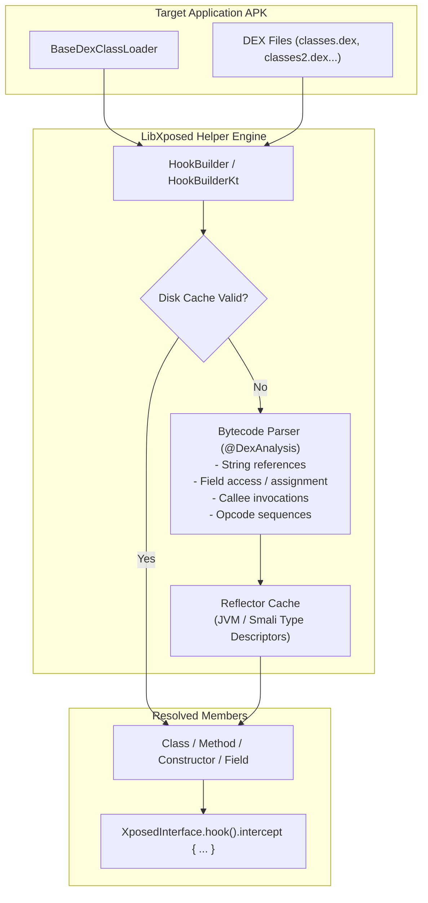

# LibXposed Helper & Matcher DSL Technical Reference

This document details the reflection utilities, structural fuzzy matcher DSL, and bytecode analysis engine provided by `io.github.libxposed:helper` and `io.github.libxposed:helper-ktx`.

> [!NOTE]
> **Source Verification**: Sourced directly from [libxposed/helper](https://github.com/libxposed/helper) source code (`HookBuilder.java`, `HookBuilderImpl.java`, `Reflector.java`, `HookBuilderKt.kt`), tested against obfuscated Android bytecode on the connected device.

---

## 1. Overview & Architecture

When developing hooks for obfuscated or heavily minified Android applications (e.g. ProGuard, R8, DexGuard), symbol names are randomized across app releases (e.g. `com.a.b.c.a(Ljava/lang/String;I)Lcom/a/b/c/d;`). Hardcoding class or method names causes hooks to break on every target application update.

The **LibXposed Helper** suite provides a two-tier solution:
1. **`io.github.libxposed:helper` (Java Core)**:
   - `Reflector`: High-performance cached reflection resolver supporting Smali descriptors and Java signatures.
   - `HookBuilder`: Declarative query builder and execution engine supporting asynchronous execution, disk-backed cache serialization, and bytecode parsing.
2. **`io.github.libxposed:helper-ktx` (Kotlin DSL)**:
   - Type-safe, idiomatic DSL with operator overloading (`+`, `-`, `and`, `or`, `not`, `conjunction`, indexed parameter binding) for clean hook definitions.



---

## 2. Gradle Setup (`build.gradle.kts`)

```kotlin
dependencies {
    compileOnly("io.github.libxposed:api:102.0.0")

    // Core Java Helper
    implementation("io.github.libxposed:helper:100.0.1")

    // Kotlin DSL extensions
    implementation("io.github.libxposed:helper-ktx:100.0.1")
}
```

---

## 3. Kotlin Matcher DSL (`helper-ktx`)

### 3.1 Basic Usage Pattern

Invoke `buildHooks` inside your module's `onPackageReady`:

```kotlin
import io.github.libxposed.helper.ktx.buildHooks
import io.github.libxposed.helper.ktx.DexAnalysis
import dalvik.system.BaseDexClassLoader

class MyModule : XposedModule() {
    @OptIn(DexAnalysis::class)
    override fun onPackageReady(param: PackageReadyParam) {
        val dexClassLoader = param.classLoader as? BaseDexClassLoader ?: return
        val apkPath = param.applicationInfo.sourceDir

        buildHooks(dexClassLoader, apkPath) {
            // Match an obfuscated activity class by hierarchy and method signature
            classes {
                superClass = "android.app.Activity".exactClass
                isPublic = true

                methods {
                    parameterCounts = 1
                    parameters = conjunction(String::class.java)
                    returnType = Boolean::class.javaPrimitiveType!!.exactClass
                    isFinal = false

                    // Match string literal referenced in method body
                    referredStrings = +"AUTH_SECRET_KEY"
                }.first().onMatch { targetMethod ->
                    log(Log.INFO, TAG, "Found target method: ${targetMethod.declaringClass.name}#${targetMethod.name}")

                    // Install hook
                    hook(targetMethod).intercept { chain ->
                        log(Log.INFO, TAG, "Auth check called with: ${chain.args[0]}")
                        chain.proceed()
                    }
                }
            }
        }
    }
}
```

---

## 4. Matcher Specifications

### 4.1 `ClassMatcher`
Filters classes in the target DEX files based on metadata:

```kotlin
classes {
    // Exact or prefix matching
    name = "com.target.security.".prefix
    superClass = "java.lang.Object".exactClass

    // Interfaces: boolean combinations using and/or/not
    containsInterfaces = +"java.io.Serializable".exactClass and +"java.lang.Runnable".exactClass

    // Modifiers
    isPublic = true
    isPrivate = false
    isProtected = false
    isPackage = false
    isAbstract = false
    isInterface = false
    isFinal = false
    isStatic = false
}
```

### 4.2 `MethodMatcher` & `ConstructorMatcher`
Filters member functions and constructors:

```kotlin
methods {
    name = "doVerify".exact // Or StringMatch patterns
    returnType = "java.lang.String".exactClass

    isPublic = true
    isStatic = false
    isFinal = false
    isSynchronized = false
    isNative = false
    isAbstract = false

    // Parameter count
    parameterCounts = 2

    // Exact parameter list ordering (conjunction)
    parameters = conjunction(String::class.java, Int::class.javaPrimitiveType)

    // Inspect parameter at specific index
    parameters = String::class.java[0] and Int::class.javaPrimitiveType[1]
}
```

### 4.3 `FieldMatcher`
Filters member fields:

```kotlin
fields {
    name = "token".exact
    type = String::class.java.exact
    isStatic = true
    isFinal = true
    isTransient = false
    isVolatile = false
}
```

---

## 5. Bytecode Analysis Engine (`@DexAnalysis`)

When method signatures are completely generic (e.g. `Object a(Object b)`), `@DexAnalysis` inspects Dalvik bytecode directly:

```kotlin
@OptIn(DexAnalysis::class)
methods {
    // 1. Match methods referencing specific constant string literals
    referredStrings = +"BEGIN RSA PRIVATE KEY" or +"api/v1/auth"

    // 2. Match methods accessing specific fields
    accessedFields = +firstField {
        type = "javax.crypto.Cipher".exactClass
    }

    // 3. Match methods that write to specific fields
    assignedFields = +firstField {
        name = "authToken".exact
    }

    // 4. Match methods invoking specific functions or constructors
    invokedMethods = +firstMethod {
        name = "doFinal".exact
    }
    invokedConstructor = +firstConstructor {
        parameterCounts = 0
    }

    // 5. Match specific Dalvik opcode sequences
    // Example: invoke-direct followed by move-result-object
    containsOpcodes = byteArrayOf(0x70.toByte(), 0x0C.toByte())
}
```

> [!TIP]
> **Performance Warning**: Bytecode inspection parses DEX structures sequentially. Always narrow the search scope first using `classes { ... }` or package prefixes before enabling `@DexAnalysis`.

---

## 6. Optimization: Caching & Asynchronous Resolution

Scanning large multi-DEX APKs on every process start introduces noticeable launch latency. `HookBuilder` provides built-in asynchronous execution and disk cache persistence.

### 6.1 Disk Cache Serialization
Cache the resolved reflection targets to disk; subsequent process boots bypass DEX analysis completely:

```kotlin
import java.io.File
import java.io.FileInputStream
import java.io.FileOutputStream

val cacheFile = File(context.cacheDir, "libxposed_hooks.cache")

buildHooks(dexClassLoader, apkPath) {
    // 1. Supply input cache if file exists
    if (cacheFile.exists()) {
        cacheInputStream = FileInputStream(cacheFile)
    }

    // 2. Supply output cache stream to save resolved targets
    cacheOutputStream = FileOutputStream(cacheFile)

    // 3. Verify cache validity against target APK version / signature
    cacheChecker = { metadata ->
        val cachedVersion = metadata["app_version_code"] as? Long
        val currentVersion = param.applicationInfo.longVersionCode
        cachedVersion == currentVersion
    }

    // Define matchers...
}
```

### 6.2 Asynchronous Background Execution
By default, `buildHooks` runs asynchronously on a worker thread and returns a `Future<?>`:

```kotlin
import java.util.concurrent.Executors
import android.os.Handler
import android.os.Looper

val executor = Executors.newFixedThreadPool(2)
val mainHandler = Handler(Looper.getMainLooper())

val future: Future<*> = buildHooks(dexClassLoader, apkPath) {
    executorService = executor
    callbackHandler = mainHandler

    exceptionHandler = { error ->
        log(Log.ERROR, TAG, "Hook resolution failed", error)
        true // Handled
    }

    // Matchers here...
}
```

---

## 7. Lazy Sequences, Fallbacks & State Binding

### 7.1 Fallback Chains (`substituteIfMiss`)
When supporting multiple app versions where method signatures changed:

```kotlin
methods {
    name = "modernAuthMethod".exact
    parameterCounts = 2
}.first()
.substituteIfMiss {
    // Fallback if modern method is absent (older app version)
    methods {
        name = "legacyAuthMethod".exact
        parameterCounts = 1
    }.first()
}
.onMiss {
    log(Log.WARN, TAG, "Neither modern nor legacy auth method was found!")
}
.onMatch { resolvedMethod ->
    hook(resolvedMethod).intercept { it.proceed() }
}
```

### 7.2 Multi-Target Lazy Binding (`LazyBind`)
When you need to verify that multiple related classes or methods are matched together before hooking:

```kotlin
val bindSession = object : LazyBind() {
    override fun onMatch() {
        log(Log.INFO, TAG, "All required security classes successfully matched!")
    }

    override fun onMiss() {
        log(Log.ERROR, TAG, "Security classes verification failed - aborting hooks.")
    }
}

classes {
    name = "com.target.SecurityManager".exactClass
}.first().bind(bindSession) { clazz ->
    // Bound class ready
}
```

---

## 8. High-Speed `Reflector` Engine

For known class and method signatures where fuzzy matching is not needed, `Reflector` provides a fast, thread-safe reflection cache supporting both Smali descriptors and Java signatures:

```java
import io.github.libxposed.helper.Reflector;

Reflector reflector = new Reflector(param.getClassLoader());

// 1. Load classes using standard names, Smali descriptors, or array notations
Class<?> c1 = reflector.loadClass("com.example.User");
Class<?> c2 = reflector.loadClass("Lcom/example/User;");
Class<?> c3 = reflector.loadClass("com.example.User[]");
Class<?> c4 = reflector.loadClass("[Lcom/example/User;");

// 2. Load methods by Smali signature (Class->method(Params)Return)
Method m1 = reflector.loadMethod("com.example.User->getName()Ljava/lang/String;");

// 3. Load methods by Java syntax signature
Method m2 = reflector.loadMethod("public java.lang.String com.example.User.getName()");

// 4. Load constructors
Constructor<?> ctor = reflector.loadConstructor("com.example.User-><init>(Ljava/lang/String;I)V");

// 5. Load fields
Field f1 = reflector.loadField("com.example.User->mToken:Ljava/lang/String;");
```
