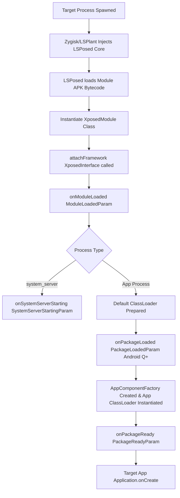
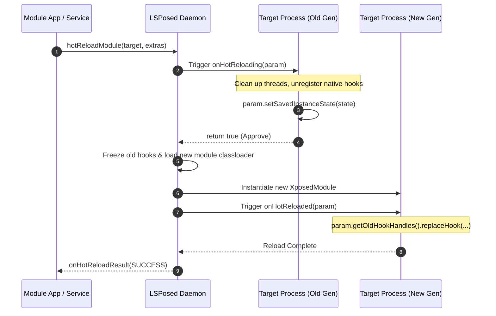

# LibXposed Lifecycle & Hot Reloading Architecture

This document provides a detailed reference for the module lifecycle, process startup phases, and the **Hot Reloading subsystem** introduced in LibXposed API 102.

---

## 1. Module Initialization Lifecycle

LibXposed executes module entries across distinct lifecycle phases within target processes:



### 1.1 Lifecycle Callbacks (`XposedModuleInterface`)

#### 1. `onModuleLoaded(ModuleLoadedParam param)`
- **When**: Invoked immediately when the module generation is loaded into a process.
- **Context**: Earliest point of module execution.
- **Parameters**:
  - `param.getProcessName()`: Process name (e.g. `com.example.app:main` or `system_server`).
  - `param.isSystemServer()`: `true` if executing inside the Android OS `system_server`.

```java
@Override
public void onModuleLoaded(@NonNull ModuleLoadedParam param) {
    log(Log.INFO, TAG, "Module loaded into: " + param.getProcessName());
    
    // Check framework properties
    long props = getFrameworkProperties();
    boolean hasRemoteCap = (props & PROP_CAP_REMOTE) != 0;
    boolean hasSystemCap = (props & PROP_CAP_SYSTEM) != 0;
}
```

#### 2. `onPackageLoaded(PackageLoadedParam param)` *(Requires Android Q+)*
- **When**: Invoked when an APK package (`android:hasCode="true"`) is loaded into the process.
- **Default ClassLoader**: At this point, `param.getDefaultClassLoader()` is available, but `AppComponentFactory` has not yet been instantiated.
- **Parameters**:
  - `param.getPackageName()`: Name of the loaded package.
  - `param.getApplicationInfo()`: The target's `ApplicationInfo`.
  - `param.isFirstPackage()`: `true` if this is the primary package of the process.
  - `param.getDefaultClassLoader()`: The base classloader.

#### 3. `onPackageReady(PackageReadyParam param)`
- **When**: The primary hook entry point! Invoked after `AppComponentFactory` has created the target application classloader and is about to create `Application`.
- **Parameters**:
  - `param.getClassLoader()`: The active application `ClassLoader` (reflects custom classloaders created by `AppComponentFactory`).
  - `param.getAppComponentFactory()`: Active `AppComponentFactory` (Android P+).
  - All getters inherited from `PackageLoadedParam`.

```java
@Override
public void onPackageReady(@NonNull PackageReadyParam param) {
    if (!param.isFirstPackage()) return; // Usually hook only the main package
    
    ClassLoader cl = param.getClassLoader();
    try {
        Class<?> targetClass = Class.forName("com.target.auth.LoginService", true, cl);
        Method targetMethod = targetClass.getDeclaredMethod("doLogin", String.class, String.class);
        
        hook(targetMethod).intercept(chain -> {
            log(Log.INFO, TAG, "Intercepted doLogin with user: " + chain.getArg(0));
            return chain.proceed();
        });
    } catch (ReflectiveOperationException e) {
        log(Log.ERROR, TAG, "Failed to resolve target hook points", e);
    }
}
```

#### 4. `onSystemServerStarting(SystemServerStartingParam param)`
- **When**: Invoked only when `isSystemServer() == true`. Replaces `onPackageLoaded` and `onPackageReady` for the base system server startup.
- **Parameters**:
  - `param.getClassLoader()`: System server class loader (contains Android internal framework services like `ActivityManagerService`, `PackageManagerService`, `WindowManagerService`).

---

## 2. Hot Reloading Architecture (API 102+)

Traditionally, updating an Xposed module required force-stopping or restarting every target app (or rebooting the entire device for system services).

**LibXposed API 102** introduces hot reloading: when the module APK is recompiled/installed, the new code generation can be injected directly into running target processes without restarting them.



---

## 3. Implementing Hot Reload in Modules

### 3.1 Enabling Auto Hot Reload (`module.prop`)
Add `autoHotReload=true` in `src/main/resources/META-INF/xposed/module.prop`:
```properties
minApiVersion=101
targetApiVersion=102
staticScope=true
autoHotReload=true
```

### 3.2 Phase 1: Old Generation Retirement (`onHotReloading`)
`onHotReloading` executes in the **old module generation** right before it is retired.

```java
@Override
public boolean onHotReloading(@NonNull HotReloadingParam param) {
    log(Log.INFO, TAG, "Preparing old module generation for hot reload...");
    
    // 1. Read optional data sent from UI trigger
    Bundle extras = param.getExtras();
    
    // 2. Save necessary state for the next generation
    // CRITICAL: ONLY use classloader-neutral types (Strings, primitives, standard Bundles)
    Bundle state = new Bundle();
    state.putLong("session_start_time", mStartTime);
    state.putInt("hook_call_counter", mCounter.get());
    param.setSavedInstanceState(state);
    
    // 3. Clean up module resources:
    // - Stop any background worker threads started by the module
    // - Unregister native hooks or C callbacks
    // - Clear JNI global references
    stopWorkerThreads();
    
    // 4. Return true to allow hot reload, or false to reject
    return true;
}
```

### 3.3 Phase 2: New Generation Activation (`onHotReloaded`)
`onHotReloaded` executes in the **new module generation**.

> [!WARNING]
> When hot reload triggers, `onModuleLoaded`, `onPackageLoaded`, and `onPackageReady` are **NOT** re-invoked. You must restore your hooks and state inside `onHotReloaded`!

```java
@Override
public void onHotReloaded(@NonNull HotReloadedParam param) {
    log(Log.INFO, TAG, "New generation active in: " + param.getProcessName());
    
    // 1. Retrieve saved instance state
    Object rawState = param.getSavedInstanceState();
    if (rawState instanceof Bundle state) {
        mStartTime = state.getLong("session_start_time");
        mCounter.set(state.getInt("hook_call_counter"));
    }
    
    // 2. Manage previous hooks:
    // Option A: Atomically replace existing hook handles with updated logic
    for (HookHandle oldHandle : param.getOldHookHandles()) {
        if ("auth_hook".equals(oldHandle.getId())) {
            oldHandle.replaceHook(chain -> {
                log(Log.INFO, TAG, "Updated auth hook interceptor running!");
                return chain.proceed();
            });
        } else {
            // Unhook any obsolete hooks from previous version
            oldHandle.unhook();
        }
    }
    
    // Option B: If unhooking all and re-installing:
    // param.getOldHookHandles().forEach(HookHandle::unhook);
    // installFreshHooks();
}
```

---

## 4. Critical Rules for ClassLoader Leak Prevention

When an old generation is unloaded, the Dalvik/ART virtual machine can only garbage-collect the old module's `ClassLoader` and associated memory if **zero references** remain:

1. **No Module Objects in `savedInstanceState`**:
   - `param.setSavedInstanceState(Object)` must never hold instances of classes defined by the module (e.g. `MyCustomConfig`, `CustomListener`).
   - Use primitive types, `String`, `byte[]`, or framework `Bundle`.

2. **No Dangling Singletons or Static Maps**:
   - Do not store module instances in target app static collections or singletons (e.g. `AppGlobals.customList.add(myModuleObj)`).

3. **Terminate Threads & Handlers**:
   - All `ExecutorService`, `HandlerThread`, or Kotlin coroutines owned by the old generation must be stopped in `onHotReloading`.

4. **Clean up JNI References**:
   - Release any `NewGlobalRef` pointers pointing to module classloader objects.
