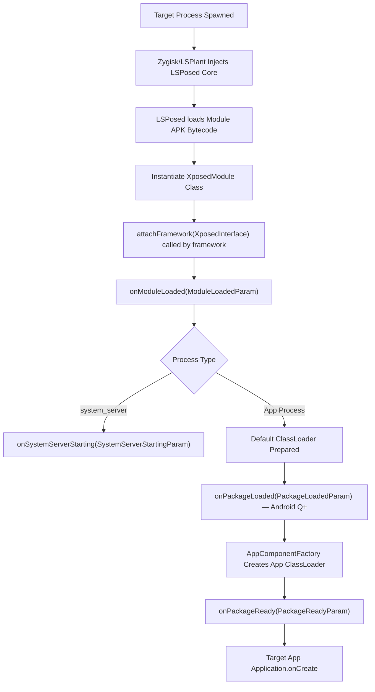
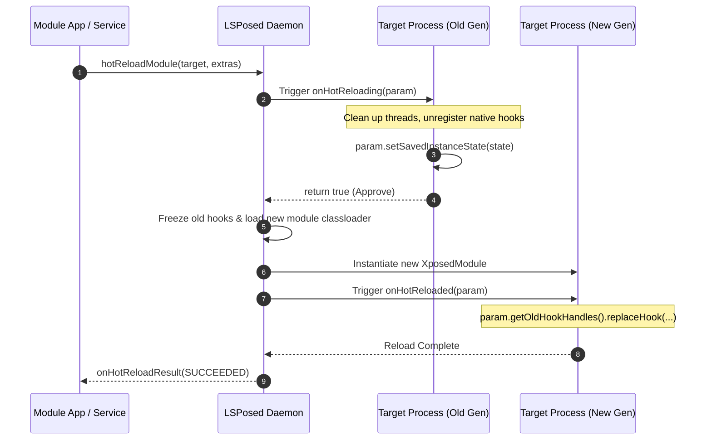

# LibXposed Lifecycle & Hot Reloading Architecture

This document provides a detailed reference for the module lifecycle, process startup phases, and the **Hot Reloading subsystem** introduced in LibXposed API 102.

> [!NOTE]
> **Source**: All lifecycle callback signatures and semantics are sourced from `XposedModuleInterface.java` in the [libxposed/api](https://github.com/libxposed/api) repository. Hot reload result statuses from `HotReloadResult.java` and `HookedTarget.java` in [libxposed/service](https://github.com/libxposed/service). Verified against LSPosed 2.2.0-it (API 102, version code 7866).

---

## 1. Module Initialization Lifecycle

LibXposed executes module entries across distinct lifecycle phases within target processes:



### 1.1 Lifecycle Callbacks (`XposedModuleInterface`)

#### 1. `onModuleLoaded(ModuleLoadedParam param)`
- **When**: Invoked immediately when the module generation is loaded into a process.
- **Context**: Earliest point of module execution. Note: modules **should not** perform initialization before this is called (i.e., not in the constructor).
- **Parameters**:
  - `param.getProcessName()`: Process name (e.g. `com.example.app:main` or `system_server`).
  - `param.isSystemServer()`: `true` if executing inside the Android OS `system_server`.

> [!IMPORTANT]
> Per the source javadoc: "This callback is called for the initial module load. Hot reload does **not** automatically replay this callback or package lifecycle callbacks."

```java
@Override
public void onModuleLoaded(@NonNull ModuleLoadedParam param) {
    log(Log.INFO, TAG, "Module loaded into: " + param.getProcessName());

    // Check framework properties
    long props = getFrameworkProperties();
    boolean hasRemoteCap = (props & PROP_CAP_REMOTE) != 0;
    boolean hasSystemCap = (props & PROP_CAP_SYSTEM) != 0;
}
```

#### 2. `onPackageLoaded(PackageLoadedParam param)` *(Requires Android Q+)*
- **When**: Invoked when an APK package (`android:hasCode="true"`) is loaded into the process.
- **Invocation**: Called **only once for each package name** loaded into the process. A process may load multiple packages (via `sharedUserId` or `createPackageContext` with `CONTEXT_INCLUDE_CODE`).
- **Default ClassLoader**: At this point, `param.getDefaultClassLoader()` is available (requires `@RequiresApi(Build.VERSION_CODES.Q)`), but `AppComponentFactory` has not yet been instantiated.
- **System Server**: In system_server, the first callback is replaced by `onSystemServerStarting`, so `param.isFirstPackage()` is **never** `true` in this callback for system_server.
- **Parameters**:
  - `param.getPackageName()`: Name of the loaded package.
  - `param.getApplicationInfo()`: The target's `ApplicationInfo`.
  - `param.isFirstPackage()`: `true` if this is the primary package of the process.
  - `param.getDefaultClassLoader()`: The base classloader (loads package code, resources, and custom `AppComponentFactory`).

#### 3. `onPackageReady(PackageReadyParam param)`
- **When**: The primary hook entry point! Invoked after `AppComponentFactory` has instantiated the classloader and is ready to create `Application`.
- **Invocation**: Called **only once for each package name**, same rules as `onPackageLoaded`.
- **System Server**: Same exclusion as `onPackageLoaded` — the first callback is replaced by `onSystemServerStarting`.
- **Parameters**:
  - `param.getClassLoader()`: The active application `ClassLoader`. May differ from `getDefaultClassLoader()` if the package has a custom `AppComponentFactory` that creates a different classloader.
  - `param.getAppComponentFactory()`: Active `AppComponentFactory` (requires `@RequiresApi(Build.VERSION_CODES.P)`).
  - All getters inherited from `PackageLoadedParam`.

```java
@Override
public void onPackageReady(@NonNull PackageReadyParam param) {
    if (!param.isFirstPackage()) return; // Usually hook only the main package

    ClassLoader cl = param.getClassLoader();
    try {
        Class<?> targetClass = Class.forName("com.target.auth.LoginService", true, cl);
        Method targetMethod = targetClass.getDeclaredMethod("doLogin", String.class, String.class);

        hook(targetMethod).intercept(chain -> {
            log(Log.INFO, TAG, "Intercepted doLogin with user: " + chain.getArg(0));
            return chain.proceed();
        });
    } catch (ReflectiveOperationException e) {
        log(Log.ERROR, TAG, "Failed to resolve target hook points", e);
    }
}
```

#### 4. `onSystemServerStarting(SystemServerStartingParam param)`
- **When**: Invoked only when `isSystemServer() == true`. **Replaces** the first `onPackageLoaded` and `onPackageReady` callbacks for the base system server startup.
- **Parameters**:
  - `param.getClassLoader()`: System server class loader (contains Android internal framework services like `ActivityManagerService`, `PackageManagerService`, `WindowManagerService`).

---

## 2. Hot Reloading Architecture (API 102+)

Traditionally, updating an Xposed module required force-stopping or restarting every target app (or rebooting the entire device for system services).

**LibXposed API 102** introduces hot reloading: when the module APK is recompiled/installed, the new code generation can be injected directly into running target processes without restarting them.



### Hot Reload Triggers
Hot reload can be triggered in two ways:
1. **Service-triggered**: Module app calls `XposedService.hotReloadModule(target, data, callback)`.
2. **Auto-triggered on APK update**: If `autoHotReload=true` in `module.prop`, but the old module's `onHotReloading` must still return `true` to proceed.

### Hot Reload Serialization
Per the source javadoc:
- Hot reloads are **serialized per target** — only one reload can be in progress for a given target process.
- Before the old hook handle list is captured, the framework **freezes old code** so further hook registrations from old code fail.
- In-flight hook calls keep using the **hook chain snapshot** that was active when they started.

---

## 3. Implementing Hot Reload in Modules

### 3.1 Enabling Auto Hot Reload (`module.prop`)
Add `autoHotReload=true` in `src/main/resources/META-INF/xposed/module.prop`:
```properties
minApiVersion=101
targetApiVersion=102
staticScope=true
autoHotReload=true
```

### 3.2 Phase 1: Old Generation Retirement (`onHotReloading`)
`onHotReloading` executes in the **old module generation** right before it is retired.

```java
/**
 * Default return value is FALSE — you must explicitly opt-in to hot reload.
 */
@Override
public boolean onHotReloading(@NonNull HotReloadingParam param) {
    log(Log.INFO, TAG, "Preparing old module generation for hot reload...");

    // 1. Read optional data sent from UI trigger (null if auto-triggered by APK update)
    Bundle extras = param.getExtras();

    // 2. Save necessary state for the next generation
    // CRITICAL: ONLY use classloader-neutral types (Strings, primitives, standard Bundles)
    // setSavedInstanceState will throw IllegalArgumentException if it detects objects from
    // the old module classloader (but this is a diagnostic aid, not a complete verifier)
    Bundle state = new Bundle();
    state.putLong("session_start_time", mStartTime);
    state.putInt("hook_call_counter", mCounter.get());
    param.setSavedInstanceState(state);

    // 3. Clean up module resources:
    // - Stop all module-owned Java and native threads
    // - Unregister native hooks and external callbacks
    // - Release JNI global references to module-classloader objects
    // - Clear references to module objects stored by system or app classes
    stopWorkerThreads();

    // 4. Return true to allow hot reload, or false to reject
    // Returning false: for service-triggered requests, reported as
    //   HotReloadResult.Status.FAILED with null message
    return true;
}
```

### 3.3 Phase 2: New Generation Activation (`onHotReloaded`)
`onHotReloaded` executes in the **new module generation**.

> [!WARNING]
> When hot reload triggers, `onModuleLoaded`, `onPackageLoaded`, and `onPackageReady` are **NOT** re-invoked. You must restore your hooks and state inside `onHotReloaded`!

> [!NOTE]
> The **default implementation** of `onHotReloaded` simply unhooks all old hooks:
> ```java
> default void onHotReloaded(@NonNull HotReloadedParam param) {
>     param.getOldHookHandles().forEach(XposedInterface.HookHandle::unhook);
> }
> ```

```java
@Override
public void onHotReloaded(@NonNull HotReloadedParam param) {
    log(Log.INFO, TAG, "New generation active in: " + param.getProcessName());

    // 1. Retrieve saved instance state
    Object rawState = param.getSavedInstanceState();
    if (rawState instanceof Bundle state) {
        mStartTime = state.getLong("session_start_time");
        mCounter.set(state.getInt("hook_call_counter"));
    }

    // 2. Read optional extras (same as sent to onHotReloading)
    Bundle extras = param.getExtras();

    // 3. Manage previous hooks:
    // Option A: Atomically replace existing hook handles with updated logic
    for (HookHandle oldHandle : param.getOldHookHandles()) {
        if ("auth_hook".equals(oldHandle.getId())) {
            oldHandle.replaceHook(chain -> {
                log(Log.INFO, TAG, "Updated auth hook interceptor running!");
                return chain.proceed();
            });
        } else {
            // Unhook any obsolete hooks from previous version
            oldHandle.unhook();
        }
    }

    // Option B: If unhooking all and re-installing:
    // param.getOldHookHandles().forEach(HookHandle::unhook);
    // installFreshHooks();
}
```

### 3.4 Framework Lifecycle After `onHotReloaded`
Per the source javadoc:
- The framework keeps the previous module generation **strongly reachable** until `onHotReloaded` finishes.
- After `onHotReloaded` returns or throws, the framework releases all references it owns to the old generation, **except** for:
  - References required by old hooks that remain installed
  - Any references kept by module code
- Classloader collection and unloading of native libraries are **runtime-dependent** and not guaranteed immediately.
- The framework does **NOT** call `UnregisterNatives`, `JNI_OnUnload`, or `dlclose` as part of hot reload.

---

## 4. Critical Rules for ClassLoader Leak Prevention

When an old generation is unloaded, the Dalvik/ART virtual machine can only garbage-collect the old module's `ClassLoader` and associated memory if **zero references** remain:

1. **No Module Objects in `savedInstanceState`**:
   - `param.setSavedInstanceState(Object)` must never hold instances of classes defined by the module (e.g. `MyCustomConfig`, `CustomListener`).
   - Use primitive types, `String`, `byte[]`, arrays, or framework `Bundle`.
   - The framework will attempt to detect and reject old-classloader objects, but this is a diagnostic aid, not a complete object graph verifier.

2. **No Dangling Singletons or Static Maps**:
   - Do not store module instances in target app static collections or singletons (e.g. `AppGlobals.customList.add(myModuleObj)`).

3. **Terminate Threads & Handlers**:
   - All `ExecutorService`, `HandlerThread`, or Kotlin coroutines owned by the old generation must be stopped in `onHotReloading`.

4. **Clean up JNI References**:
   - Release any `NewGlobalRef` pointers pointing to module classloader objects.
   - If native code is still running after all Java references to the module classloader are cleared, the runtime unloading of native libraries **may crash the process** — this is a module lifecycle bug.

---

## 5. `HotReloadedParam` Interface Reference

```java
@SinceApi(XposedInterface.API_102)
interface HotReloadedParam extends ModuleLoadedParam {
    // Data passed from the module app when triggering hot reload (null if auto-triggered)
    @Nullable Bundle getExtras();

    // Data set in HotReloadingParam.setSavedInstanceState(Object)
    @Nullable Object getSavedInstanceState();

    // Hook handles created by the previous generation of this module.
    // New code can remove or atomically replace these via HookHandle.replaceHook(Hooker)
    @NonNull List<XposedInterface.HookHandle> getOldHookHandles();
}
```

## 6. `HookedTarget` States Reference (API 102+)

When querying running targets via `XposedService.getRunningTargets()`:

| State | Meaning |
| :--- | :--- |
| `UP_TO_DATE` | Running the currently installed module code |
| `STALE` | Running old module code; may be hot-reloaded |
| `RELOADING` | Currently being hot-reloaded |
| `FAILED` | Last hot reload attempt failed (module refused or exception) |

```java
public final class HookedTarget {
    public int getUid();                    // Process UID (display/diagnostics)
    public int getPid();                    // Process ID (display only, NOT target identity)
    public @NonNull String getProcessName(); // Android process name
    public @NonNull State getState();       // UP_TO_DATE, STALE, RELOADING, FAILED
    public long getLoadedVersionCode();     // Version code of loaded module (diagnostic only)
}
```

## 7. `HotReloadResult` Status Reference (API 102+)

| Status | Meaning |
| :--- | :--- |
| `SUCCEEDED` | Hot reload completed successfully |
| `FAILED` | Old module refused reload (`message` is null) or exception occurred (`message` contains diagnostic) |
| `UNSUPPORTED` | Target doesn't support hot reload (e.g., module has multiple entry classes) |
| `IN_PROGRESS` | Target is already being hot-reloaded |
| `PROCESS_DIED` | Target process died before hot reload could complete |

```java
// Record type (Java 16+):
public record HotReloadResult(@NonNull Status status, @Nullable String message) { }
```
