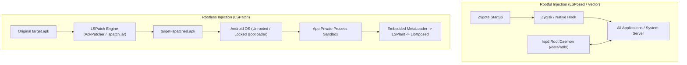
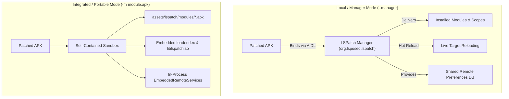

# LSPatch Rootless Patching Architecture & Guide

Expert guide and comprehensive technical reference manual for **LSPatch** — the rootless ART hooking companion to **LSPosed** and **Vector**.

---

## 1. Introduction & Conceptual Mental Model

**LSPatch** is a rootless runtime modification framework designed to execute modern **LibXposed** (API 101/102+) and legacy **XposedBridge** modules without requiring root privileges, an unlocked bootloader, or system-level modifications (Magisk / KernelSU / APatch / Zygisk).

Where LSPosed hooks Zygote at the system level to inject modules across the entire Android OS, LSPatch rewrites a target application's APK directly. It embeds a lightweight bootstrap loader and the runtime hook engine into the target APK itself, allowing the application to self-host and execute modules within its own unprivileged sandbox.



### 1.1 Architectural Comparison: LSPosed (Root) vs. LSPatch (Rootless)

| Dimension | LSPosed (Rootful / Vector) | LSPatch (Rootless) |
| :--- | :--- | :--- |
| **Prerequisites** | Unlocked bootloader, Root (Magisk/KernelSU/APatch), Zygisk | Standard Android 9.0+ (API 28+), No root, Stock ROM |
| **Injection Point** | System Zygote initialization via Zygisk / LSPlant | Application `AppComponentFactory` lifecycle stub |
| **Hook Scope** | System-wide: Any installed app, `system_server`, System UI | **Single target app process only** |
| **System Modification** | Modifies Android boot/runtime via root overlays | Modifies only the target APK archive; system untouched |
| **Hook Engine** | LSPlant (native ART method entry-point redirection) | LSPlant + Dobby (embedded in-process native library) |
| **Process Isolation** | Global root daemon (`lspd`) coordinates all modules | Isolated to host app sandbox; no cross-app privileges |
| **Module Management** | Central LSPosed Manager app | **Local/Manager Mode** (via manager) or **Integrated Mode** (zero-manager) |
| **Hot Reloading (API 102)**| Full daemon-coordinated dynamic hot reload | Supported in Manager Mode; Unsupported in Integrated Mode |
| **Signature Status** | Original app signatures untouched | APK must be re-signed (requires built-in Signature Bypass) |
| **Anti-Tamper Detection** | Transparent to app signatures; hidden by Zygisk | Detectable via signature checks unless bypassed at L1-L3 |

---

## 2. Binary & APK Rewriting Architecture

LSPatch transforms an existing APK without decompiling or modifying its Dalvik bytecode. This ensures maximum stability and zero bytecode corruption.


### 2.1 The Nested Zip Strategy (`origin.apk`)
- Rather than unpacking and modifying the target's dex files, LSPatch packages the entire original APK byte-for-byte into `assets/lspatch/origin.apk`.
- **4 KiB Page Alignment**: `origin.apk` is stored completely uncompressed and aligned to a 4096-byte boundary using `apkzlib`'s `AlignmentRules.constantForSuffix(ORIGINAL_APK_ASSET_PATH, 4096)`. This allows the Android kernel and ART to `mmap()` code and assets directly out of the nested APK without copying.
- **Zero-Byte Inflation (File Linking)**: Files that do not need modification (assets, resources, native libraries) are linked into the outer ZIP directory using `NestedZip.addFileLink()`. The outer APK references the byte ranges inside the nested `origin.apk`, preventing file duplication and keeping the patched APK size close to 1x the original.

### 2.2 Component Factory Redirection
The Android system initializes an application by reading the `appComponentFactory` attribute from the `<application>` tag in `AndroidManifest.xml`.
- LSPatch rewrites this attribute to:
  ```xml
  android:appComponentFactory="org.lsposed.lspatch.metaloader.LSPAppComponentFactoryStub"
  ```
- The original factory (e.g. `androidx.core.app.CoreComponentFactory`) is preserved inside the configuration payload and restored at runtime.
- Because `AppComponentFactory` is instantiated before any `Application`, `Activity`, `Service`, or `ContentProvider`, LSPatch gains control before any application code can run.

### 2.3 Dual Configuration Storage
The patch configuration (`PatchConfig`) is serialized to JSON and stored in two distinct places:
1. **Manifest `<meta-data>`**: Base64-encoded under `<meta-data android:name="lspatch" android:value="..."/>`. This allows the LSPatch Manager or external tools to inspect patch configurations and original signatures via `PackageManager.getApplicationInfo()` without opening or reading the APK.
2. **Asset File**: Written directly to `assets/lspatch/config.json`. This allows the runtime loader to read settings immediately without relying on `PackageManager` or Android context.

### 2.4 MetaLoader Dex vs. Loader Dex
- **`metaloader.dex`**: A tiny, ultra-minimal dex compiled to be `classes.dex` in the outer APK. Its sole job is to provide `LSPAppComponentFactoryStub`, locate the architecture-specific native library, load it into memory, and bootstrap the framework.
- **`loader.dex`**: The complete framework runtime (LSPlant, Vector/LSPosed core, LibXposed bridge, and IPC handlers).
- **`--injectdex` alternative**: If `--injectdex` is specified, LSPatch does not replace `classes.dex`. Instead, it leaves all original `classes.dex ... classesN.dex` intact and appends the metaloader as `classes(N+1).dex`. This is required for applications whose isolated multi-processes or custom classloader trees expect original dex indices to remain unchanged.

---

## 3. Runtime Bootstrap & Execution Pipeline

The runtime bootstrap executes in strict stages to ensure hooks and signature bypasses are established before the target application can execute any anti-tamper logic.

```mermaid
sequenceDiagram
    autonumber
    participant OS as Android OS (Zygote)
    participant Stub as LSPAppComponentFactoryStub (MetaLoader)
    participant Native as liblspatch.so (JNI / LSPlant)
    participant Loader as LSPApplication (loader.dex)
    participant Sig as SigBypass (PM / Libc / SVC)
    participant Target as Target Application Code

    OS->>Stub: Instantiate LSPAppComponentFactoryStub
    Note over Stub: static { bootstrap(); } executes
    Stub->>Stub: Resolve CPU ABI & read config.json
    alt Manager Mode
        Stub->>Stub: Locate Manager APK via IPackageManager & load loader.dex + liblspatch.so
    else Integrated Mode
        Stub->>Stub: Extract loader.dex & liblspatch.so from own assets
    end
    Stub->>Native: System.load(liblspatch.so)
    Native->>Native: JNI_OnLoad -> PatchLoader::Init()
    Native->>Native: LSPlant::InitArtHooker() -> Disable ART inlining & JIT profiling
    Native->>Native: Create InMemoryDexClassLoader(loader.dex)
    Native->>Loader: Invoke LSPApplication.onLoad()
    Loader->>Loader: Extract origin.apk to cache/lspatch/origin/<crc>.apk
    Loader->>Loader: Replace ActivityThread mBoundApplication.info with origin LoadedApk
    Loader->>Loader: Startup.initXposed() & load modern/legacy modules
    Loader->>Sig: SigBypass.doSigBypass(level) [Arm PM / Libc openat / SVC hooks]
    Loader->>Loader: realizeLoadedApk() -> Load target AppComponentFactory
    Note over Target: Target <clinit> runs (Safely intercepted by active hooks)
    Loader->>Target: Hand over execution to original Application
```

### 3.1 Stage-by-Stage Breakdown

1. **MetaLoader Bootstrap**:
   - `dalvik.system.VMRuntime.getRuntime().vmInstructionSet()` resolves the CPU architecture (`armeabi-v7a`, `arm64-v8a`, `x86`, `x86_64`).
   - In **Manager Mode**, the stub uses `IPackageManager` to query the manager's `sourceDir`, extracting `loader.dex` and loading `liblspatch.so` directly out of the manager's APK.
   - In **Integrated Mode**, both files are loaded directly from the application's own assets.
   - `System.load()` triggers `JNI_OnLoad` in `liblspatch.so`.

2. **Native Runtime Initialization (`PatchLoader::Load`)**:
   - Initializes `lsplant::InitInfo` with native Dobby inline hook handlers and ART symbol resolvers.
   - **Disables ART Inlining**: Calls `art::ProfileSaver::DisableInline()` and `art::FileManager::DisableBackgroundVerification()` to prevent the ART compiler from inlining hooked target methods.
   - **XResources Super Injection**: Injects a dummy parent classloader defining `xposed.dummy.XResourcesSuperClass` extending `android.content.res.Resources` so that resource hooking classes resolve cleanly without ART class link errors.
   - Instantiates an `InMemoryDexClassLoader` containing `loader.dex` and invokes `LSPApplication.onLoad()`.

3. **Context Reconstruction & APK Redirection**:
   - `createLoadedApkWithContext()` reads `origin.apk` from assets.
   - Computes CRC32 and extracts the original APK to the app's cache directory:
     ```text
     /data/user/0/<packageName>/cache/lspatch/origin/<crc>.apk
     ```
   - Sets file permissions to read-only (`setWritable(false)`).
   - Replaces `ActivityThread.mBoundApplication.info` with a fresh `LoadedApk` pointed directly to the extracted `origin.apk`. The target app now reads its own resources, assets, and classes from the pristine original.

4. **Module Loading & Lifecycle Hooks**:
   - `Startup.initXposed()` initializes the framework context.
   - Instantiates modern LibXposed modules via `XposedInit.loadModules()` and legacy modules via `handleLoadPackage`.
   - **Embed Delivery**: In Integrated Mode, delivers `IXposedService` binder directly in-process to `io.github.libxposed.service.XposedServiceHelper.onBinderReceived()`.

5. **Signature Bypass Arming**:
   - `SigBypass.doSigBypass()` arms Java, libc, and raw-syscall redirects *before* the application's real classloader is realized. This guarantees that any tamper detection wired into static initializers (`<clinit>`) or JNI constructors is spoofed immediately.

6. **LoadedApk Realization**:
   - Calls `appLoadedApk.getClassLoader()`. This fires `onPackageLoaded`, instantiates the original `AppComponentFactory`, runs its `<clinit>`, and dispatches `onPackageReady`.
   - Repoints all `ActivityClientRecord` references in `ActivityThread.mActivities` from the stub to the real `LoadedApk`.

---

## 4. Execution Modes: Local (Manager) vs. Integrated (Portable)

LSPatch supports two distinct operational modes:



### 4.1 Local / Manager Mode (`PatchMode.Local`)
Activated via `--manager` flag or selecting "Local Mode" in the manager UI.

- **How it Works**:
  - The patched APK contains only `metaloader.dex` and the configuration asset.
  - At runtime, it dynamically binds to the installed LSPatch Manager via AIDL (`org.lsposed.lspatch.manager.ModuleService`).
  - The manager provides the loader bytecode, native libraries, active modules list, and remote configuration.
- **Advantages**:
  - **Dynamic Scope & Module Toggling**: You can enable, disable, add, or configure modules in the manager without modifying or reinstalling the patched APK.
  - **Hot Reloading (API 102+)**: Supports live module code reloading via `ManagerHotReloadDriver` and `IProcessChannel`.
  - **Minimal APK Size**: Patched APK is virtually identical in size to the original.
- **Disadvantages**:
  - Requires the LSPatch Manager app to remain installed on the device.
  - Cannot be shared as a standalone APK to users who do not have the manager.

#### Manager Cloaking & Custom Package Names
To prevent target apps from detecting the presence of `org.lsposed.lspatch`:
- The manager can cloak itself under a randomly generated package name (e.g. `com.android.providers.media.module`).
- When patching via CLI, use `--manager-package <customPackage>` to bind directly to the cloaked manager.
- At runtime, `LSPAppComponentFactoryStub` evaluates candidates in order:
  1. The custom package name recorded at patch time.
  2. The stock package name (`org.lsposed.lspatch`).
  If a manager was renamed or uncloaked, the fallback logic prevents app crashes.

### 4.2 Integrated / Portable Mode (`PatchMode.Integrated`)
Activated by specifying `-m <module.apk>` without the `--manager` flag.

- **How it Works**:
  - The patcher bakes `loader.dex`, `liblspatch.so` (for all 4 architectures: ARMv7, ARMv8, x86, x86_64), and each specified module APK into `assets/lspatch/`.
  - Modules are stored under `assets/lspatch/modules/<packageName>.apk`.
  - At runtime, `LocalApplicationService` and `EmbeddedRemoteServices` provide completely in-process IPC.
- **Advantages**:
  - **100% Standalone & Portable**: The resulting APK installs and runs on any non-rooted device. No manager, helper app, or root software is needed.
  - **Zero Inter-App IPC Detection**: Target app does not communicate with external manager services.
- **Disadvantages & Operational Differences**:
  - **Hot Reload Unsupported**: `HotReloadDriver.UNSUPPORTED` returns `HOT_RELOAD_UNSUPPORTED` because there is no external APK source to reload newer generations from.
  - **Static Module Configuration**: Modifying modules requires re-patching the APK.
  - **APK Size**: Increases by the size of the embedded modules and multi-ABI native binaries (~5–15 MB).

---

## 5. Signature Bypass Subsystem (Deep Dive)

When an APK is patched, its original cryptographic signature is replaced by the patcher's signing key. Applications with built-in self-verification or anti-tamper mechanisms check their own signatures via Android APIs or native file reads.

LSPatch implements a multi-tier **Signature Bypass** subsystem (`-l, --sigbypasslv <0..3>`):

| Level | Name | Technical Mechanism | Protection Defeated | Risk / Detection Footprint |
| :--- | :--- | :--- | :--- | :--- |
| **0** | `DISABLE` | None. Re-signed signatures exposed as-is. | None | Zero overhead; cleanest if app has no signature checks |
| **1** | `PM` | Java-level `PackageManager` method & CREATOR hooks | Standard Android API signature queries | Low overhead; purely within Java framework |
| **2** | `PM + OPENAT` | Hooks libc `__openat` via LSPlant inline hook | Native code reading `base.apk` directly via libc | Low; redirects exact byte-match paths |
| **3** | `PM + OPENAT + SVC` | Instruments raw `svc #0` instructions in ARM64 native code | Hardcore packers using direct inline assembly syscalls | Higher; rewrites native instructions (fails checksumming) |

### 5.1 Level 1: Java PackageManager Spoofing
LSPatch hooks multiple layers of the Android Package Manager inside the target process:
1. **`PackageParser.generatePackageInfo`**: Catches in-process package parsing and replaces `packageInfo.signatures` with the original certificate.
2. **`PackageInfo.CREATOR` Proxy**: Replaces the static `Parcelable.Creator` for `PackageInfo` so that any `PackageInfo` unmarshalled across Binder from `system_server` has its signatures array rewritten. Clears `Parcel.mCreators` and `sPairedCreators` caches.
3. **`ApplicationPackageManager.getPackageInfo`**: Intercepts direct app-level queries, including `GET_SIGNING_CERTIFICATES` (Android 9+) and overwrites both `signatures` and `signingInfo.mSigningDetails`.
4. **`PackageManager.getPackageArchiveInfo`**: Hooks archive file parsing on API 30+ where apps parse their own APK using `getPackageResourcePath()`.
5. **`ApplicationPackageManager.hasSigningCertificate`**: Intercepts boolean certificate comparison checks and returns `true` if the queried certificate matches the original raw X.509 or SHA-256 digest.

### 5.2 Level 2: Libc `__openat` Redirection
Packers and integrity SDKs often bypass Java APIs by opening `/data/app/.../base.apk` directly via native C runtime functions (`fopen`, `open`, `openat`).
- In libc, all file open functions funnel into `__openat`.
- LSPatch installs an inline hook on `__openat` using LSPlant:
  ```cpp
  if (pathname == apkPath) {
      LOGD("Redirect openat from {} to {}", pathname, redirectPath);
      return backup(fd, redirectPath.c_str(), flag, mode);
  }
  ```
- Whenever the application opens its own installed APK path, the call is transparently redirected to the cached, unadulterated `origin.apk`. Any integrity check reading the APK Signing Block reads the original signature bytes.

### 5.3 Level 3: ARM64 Raw `svc` Syscall Instrumentation
Advanced packers (e.g. SecNeo, Tencent Legu, Bangcle) bypass libc entirely by writing raw inline assembly `svc #0` (instruction opcode `0xd4000001` on ARM64) to trigger syscalls directly through the Linux kernel.
- **Instruction Trampoline**: LSPatch uses Dobby to scan all executable `PT_LOAD` segments of the app's native libraries for `0xd4000001`.
- It enables **Near-Branch Trampolines** (`dobby_enable_near_branch_trampoline`), ensuring that origin patches are strictly 4 bytes wide (a single `b` branch instruction), preventing overwrites of adjacent functions.
- **Syscall Filter**: In `svcHandler`, it checks register `x8` for `__NR_openat` (56) or `__NR_openat2` (437). If register `x1` matches `apkPath`, it overwrites `x1` with `redirectPath.c_str()`.
- **Dynamic Linker Hooking**: Packers frequently decrypt their core security libraries at runtime and load them with `dlopen`. LSPatch hooks the internal linker functions `__loader_android_dlopen_ext` and `__loader_dlopen` (preserving `caller_addr` for namespace resolution) to trigger an immediate rescan of newly loaded libraries.

> [!WARNING]
> **Trade-off Notice**: Level 3 modifies code memory (executable text segments). If an application validates its own code integrity by hashing its `.text` section, Level 3 will trigger detection. **Always prefer Level 2 unless Level 2 is proven insufficient.**

---

## 6. Storage Access & Documents Provider

LSPatch includes an optional, built-in **Storage Access Framework (SAF)** provider (`--documents-provider`) powered by `LSPatchDocumentsProvider`.

### 6.1 Purpose & Security Architecture
In standard Android, an application's private internal storage (`/data/data/<package>/`) is accessible only by root or by that app's UID. On non-rooted devices, inspecting private databases, shared preferences, or cached files is impossible.
- When `--documents-provider` is enabled, the patcher injects:
  ```xml
  <provider
      android:name="org.lsposed.lspatch.loader.LSPatchDocumentsProvider"
      android:authorities="<package>.lspatch.documents"
      android:exported="true"
      android:grantUriPermissions="true"
      android:permission="android.permission.MANAGE_DOCUMENTS">
      <intent-filter>
          <action android:name="android.content.action.DOCUMENTS_PROVIDER" />
      </intent-filter>
  </provider>
  ```
- **Permission Guard**: The provider requires `android.permission.MANAGE_DOCUMENTS` — a platform-signature permission held exclusively by the Android system DocumentsUI. Third-party apps cannot query the provider directly; access is granted only when the user selects a folder via the system document picker.
- **Classloader Bridging (`bridgeDocumentsProviderClass`)**: Because the provider class resides inside `loader.dex` (an `InMemoryDexClassLoader`) while Android instantiates components using the application's base classloader, LSPatch splices a filtering classloader into the parent chain of the app's classloader to resolve `LSPatchDocumentsProvider` seamlessly.

---

## 7. Service & Remote Preferences Under LSPatch

LSPatch fully implements modern LibXposed IPC (`io.github.libxposed:service`), allowing modules to use `RemotePreferences` and `RemoteFiles`.

### 7.1 Remote Preferences Engine (`RemotePreferenceStore`)
- Sourced directly from Vector's daemon database architecture.
- Backed by an app-private SQLite database: `lspatch-xposed-remote.db`.
- Table Schema:
  ```sql
  CREATE TABLE configs (
      module_pkg_name TEXT NOT NULL,
      user_id INTEGER NOT NULL,
      `group` TEXT NOT NULL,
      `key` TEXT NOT NULL,
      data BLOB,
      PRIMARY KEY (module_pkg_name, user_id, `group`, `key`)
  );
  ```
- **Storage Locations**:
  - **Manager Mode**: Database resides in the LSPatch Manager's private directory. Both module settings UI and the hooked app read and write to this single synchronized store.
  - **Integrated Mode**: Database resides inside the target app's private files directory (`/data/data/<targetPackage>/databases/`).

### 7.2 API Capabilities & Limitations Under LSPatch

| API Method / Property | Manager Mode Behavior | Integrated Mode Behavior | Rootful LSPosed Comparison |
| :--- | :--- | :--- | :--- |
| `service.frameworkName` | Returns `"LSPatch"` | Returns `"LSPatch"` | Returns `"LSPosed"` |
| `service.apiVersion` | `102` (API 102) | `102` (API 102) | `102` (API 102) |
| `service.frameworkProperties` | `PROP_CAP_REMOTE` | `PROP_CAP_REMOTE` | `PROP_CAP_SYSTEM \| PROP_CAP_REMOTE` |
| `getRemotePreferences()` | Full read/write support | Full read/write support | Full read/write support |
| `openRemoteFile()` | Full read/write support | Full read/write support | Full read/write support |
| `requestScope()` | **Always fails**: Scope fixed at patch time | **Always fails**: Scope fixed at patch time | Programmatic runtime approval prompt |
| `hotReloadModule()` | Supported via `ManagerHotReloadDriver` | **Throws `HOT_RELOAD_UNSUPPORTED`** | Fully supported across all target processes |

---

## 8. Command-Line Tool Reference (`lspatch.jar`)

The standalone command-line patcher `lspatch.jar` enables automated patching in CI/CD pipelines, build scripts, and developer terminals.

### 8.1 Command Syntax
```bash
java -jar lspatch.jar [options] <target_apk_or_split_apks...>
```

### 8.2 Parameter Matrix

| Option Flag | Argument | Default | Description |
| :--- | :--- | :--- | :--- |
| `-o, --output` | `<dir>` | `.` | Directory where patched APKs will be saved |
| `-f, --force` | None | `false` | Overwrite existing output files without prompting |
| `-d, --debuggable` | None | `false` | Sets `android:debuggable="true"` in output manifest |
| `-l, --sigbypasslv` | `0..3` | `0` | Signature bypass level: `0` (off), `1` (PM), `2` (PM+openat), `3` (PM+openat+svc) |
| `-m, --embed` | `<apk...>` | None | Path to one or more module APKs to embed (activates Integrated Mode) |
| `--manager` | None | `false` | Activates Manager Mode (cannot be combined with `-m`) |
| `--manager-package` | `<pkg>` | Built-in | Specifies custom manager package name for cloaked setups |
| `-k, --keystore` | 4 arguments | Built-in | Custom keystore: `<path> <password> <alias> <alias_password>` |
| `--injectdex` | None | `false` | Injects loader as `classes(N+1).dex` instead of replacing `classes.dex` |
| `--version-code` | `<int>` | Original | Overwrites `versionCode` (useful for allowing updates or downgrade installs) |
| `--target-sdk` | `<int>` | Original | Overwrites `targetSdkVersion` |
| `--name` | `<string>` | Original | Overwrites the application launcher label |
| `--extract-libs` | None | `false` | Sets `android:extractNativeLibs="true"` |
| `--cleartext` | None | `false` | Sets `android:usesCleartextTraffic="true"` (permits unencrypted HTTP) |
| `--add-permission` | `<string>` | None | Adds `<uses-permission>` (repeatable; e.g. `INTERNET` or full string) |
| `--documents-provider` | None | `false` | Injects SAF DocumentsProvider for `/data/data/<pkg>` file access |
| `-v, --verbose` | None | `false` | Enables verbose diagnostic output |
| `-h, --help` | None | `false` | Prints parameter help and exit codes |

### 8.3 Output Naming Convention
LSPatch formats output files using the original basename and the framework version code:
```text
<original_basename>-<versionCode>-lspatched.apk
```
Example: `twitter_10.20.0-394-lspatched.apk`.

---

## 9. Practical Automation & CLI Recipes

### Recipe 1: Standard Manager Mode Patch
Use this when you have the LSPatch Manager installed and want to toggle modules dynamically:
```bash
java -jar lspatch.jar \
    --manager \
    -l 2 \
    -o ./dist \
    -f \
    com.target.app.apk
```

### Recipe 2: Standalone Portable Patch with Embedded Modules
Creates an APK that runs on any device without the manager:
```bash
java -jar lspatch.jar \
    -m /path/to/ModuleOne.apk /path/to/ModuleTwo.apk \
    -l 2 \
    -o ./dist \
    -f \
    com.target.app.apk
```

### Recipe 3: Multi-APK (App Bundle / Split APKs) Patching
When patching modern split APK bundles (e.g. extracted via `adb shell pm path` or SAI):
```bash
java -jar lspatch.jar \
    --manager \
    -l 2 \
    -o ./patched_splits \
    -f \
    base.apk split_config.arm64_v8a.apk split_config.xxhdpi.apk
```
> [!NOTE]
> Only the APK declaring `<application>` (typically `base.apk`) receives the metaloader and rewritten manifest. Split APKs are automatically repacked and re-signed with the identical key so they install cleanly alongside `base.apk`.

### Recipe 4: Security Research & Reverse Engineering Patch
Enables debugging, cleartext traffic, private storage access via SAF, and network permissions:
```bash
java -jar lspatch.jar \
    -m /path/to/SslUnpinningModule.apk \
    -d \
    --cleartext \
    --documents-provider \
    --add-permission INTERNET \
    --add-permission ACCESS_NETWORK_STATE \
    -l 2 \
    -o ./analysis \
    -f \
    target.apk
```

### Recipe 5: Signing with a Custom Production Keystore
```bash
java -jar lspatch.jar \
    --manager \
    -k /keys/my_release.jks password123 my_alias password123 \
    -l 2 \
    -o ./dist \
    target.apk
```

---

## 10. Developer Guide: Writing Modules for Both LSPosed & LSPatch

To ensure an Xposed module functions flawlessly across both rooted LSPosed and rootless LSPatch environments, adhere to the following design rules:

### 10.1 Never Rely on System-Server or Cross-App Scope
- LSPatch executes **exclusively inside the target app's process**.
- Code attempting to hook `android` (`system_server`), SystemUI, or foreign applications will never trigger in LSPatch.
- Use `param.packageName` or `param.isFirstPackage` to confirm target process identity:
  ```kotlin
  override fun onPackageReady(param: PackageReadyParam) {
      if (param.packageName != "com.target.app") return
      // Safe to hook target application logic
  }
  ```

### 10.2 Handle Process Isolation (`isIsolated()`)
LSPatch automatically skips isolated processes (e.g. WebView/Chromium renderers with UIDs >= 90000) during bootstrap to prevent sandbox crashes. Ensure your module does not expect hooks to fire in isolated sub-processes.

### 10.3 Programmatic Framework Capability Detection
Do not assume `PROP_CAP_SYSTEM` is available. Always check the capability bitmask:
```kotlin
val props = xposedService.frameworkProperties
val isRootful = (props and XposedService.PROP_CAP_SYSTEM) != 0L
val isRemoteSupported = (props and XposedService.PROP_CAP_REMOTE) != 0L

if (!isRootful) {
    Log.i("MyModule", "Running under rootless environment (LSPatch)")
}
```

### 10.4 Companion UI App Integration
In Integrated Mode, the target app runs without a manager. If your module includes a settings Activity:
- Use `io.github.libxposed:service` and `XposedServiceHelper`.
- In Integrated Mode, `XposedService` is delivered directly in-process, allowing the hook itself to write default configurations.
- In Manager Mode, the companion UI communicates through the LSPatch Manager.

---

## 11. Troubleshooting & Diagnostics Matrix

When diagnosing issues with patched applications, consult the table below:

| Symptom / Error | Root Cause | Remediation |
| :--- | :--- | :--- |
| **Crash on launch: `ClassNotFoundException: LSPAppComponentFactoryStub`** | `classes.dex` was corrupted or packaging discarded the metaloader | Verify patch was generated with modern LSPatch (>= v0.6+). Ensure `--injectdex` was not misused on a standard single-dex app. |
| **Crash on launch: `No installed LSPatch manager carries the loader`** | App was patched in Manager Mode, but LSPatch Manager is not installed or has a different package name | Install the LSPatch Manager. If the manager was cloaked under a custom package, re-patch with `--manager-package <cloakedName>`. |
| **App detects tampering / Signature Mismatch** | App checks its own APK signature using methods not covered by Level 0/1 | Elevate signature bypass level: re-patch with `-l 2` (covers libc `__openat`). If the app uses raw inline assembly syscalls, re-patch with `-l 3`. |
| **Split APK install fails: `INSTALL_FAILED_UPDATE_INCOMPATIBLE`** | Split APKs were signed with differing keys or not all splits were patched | Always pass all split APKs together in a single `lspatch` command invocation. |
| **Downgrade error: `INSTALL_FAILED_VERSION_DOWNGRADE`** | Installed app has a higher `versionCode` than the patched build | Use `--version-code <currentCode+1>` when patching to satisfy Android installer constraints. |
| **Hot reload does not trigger in Integrated Mode** | Hot reloading requires a live external daemon/manager | By design. Hot reload is unsupported in Integrated Mode (`HOT_RELOAD_UNSUPPORTED`). Re-patch and reinstall the APK, or switch to Manager Mode. |
| **Logcat debugging** | Need to trace LSPatch internal operations | Filter logcat by tags: `adb logcat -s LSPatch LSPatch-MetaLoader LSPatch-SigBypass LSPatch-RemotePrefs LSPatch-HotReload` |
