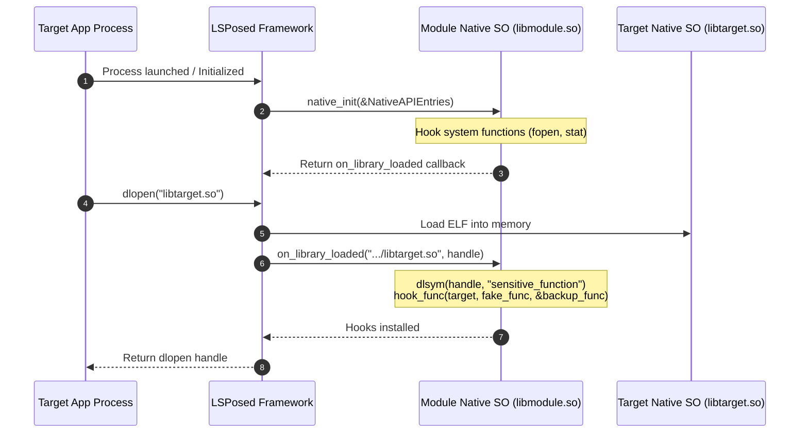

# LSPosed Native Hooking Specification & Guide

This document provides a comprehensive reference for developing C/C++ native hook modules for LSPosed using Android NDK.

---

## 1. Native Hooking Architecture

LSPosed provides a high-performance native hooking infrastructure powered by **LSPlant** and inline hooking engines. When a native shared library is loaded by an application (via `dlopen` or `System.loadLibrary`), LSPosed intercepts the library load event and invokes your module's native callback, allowing you to hook native functions and JNI tables.



---

## 2. Header Specification (`xposed_native.h`)

Create a header file in your C/C++ native source directory:

```c++
#pragma once

#include <stdint.h>
#include <stddef.h>

#ifdef __cplusplus
extern "C" {
#endif

/**
 * Hook function pointer type.
 * @param func Pointer to the target function to be hooked
 * @param replace Pointer to your replacement (hook) function
 * @param backup Pointer to store the trampoline address to call the original function
 * @return 0 on success, non-zero error code on failure
 */
typedef int (*HookFunType)(void *func, void *replace, void **backup);

/**
 * Unhook function pointer type.
 * @param func Pointer to the hooked target function
 * @return 0 on success, non-zero error code on failure
 */
typedef int (*UnhookFunType)(void *func);

/**
 * Callback invoked every time a native shared library is loaded in the process.
 * @param name Absolute filesystem path or soname of the loaded library (e.g. "/data/app/.../libtarget.so")
 * @param handle Dynamic linker handle to the loaded library (usable with dlsym)
 */
typedef void (*NativeOnModuleLoaded)(const char *name, void *handle);

/**
 * Structure passed by LSPosed to native_init containing native API pointers.
 */
typedef struct {
    uint32_t version;            // Struct version
    HookFunType hook_func;       // Function hooker
    UnhookFunType unhook_func;   // Function unhooker
} NativeAPIEntries;

/**
 * Exported entry point for native Xposed modules.
 */
typedef NativeOnModuleLoaded (*NativeInit)(const NativeAPIEntries *entries);

#ifdef __cplusplus
}
#endif
```

---

## 3. Native Module Implementation

### 3.1 Implementing `native_init` & Callbacks (`module_native.cpp`)

```c++
#include <jni.h>
#include <dlfcn.h>
#include <string.h>
#include <stdio.h>
#include <string>
#include <android/log.h>
#include "xposed_native.h"

#define LOG_TAG "LSPosedNative"
#define LOGI(...) __android_log_print(ANDROID_LOG_INFO, LOG_TAG, __VA_ARGS__)
#define LOGE(...) __android_log_print(ANDROID_LOG_ERROR, LOG_TAG, __VA_ARGS__)

static HookFunType hook_func = nullptr;
static UnhookFunType unhook_func = nullptr;

// ==============================================================================
// 1. System C Library Hooking (e.g., fopen)
// ==============================================================================
static FILE *(*backup_fopen)(const char *filename, const char *mode) = nullptr;

static FILE *fake_fopen(const char *filename, const char *mode) {
    if (filename != nullptr && strstr(filename, "restricted_file.txt") != nullptr) {
        LOGI("Blocking access to restricted file: %s", filename);
        return nullptr;
    }
    return backup_fopen(filename, mode);
}

// ==============================================================================
// 2. Target Library Function Hooking
// ==============================================================================
static int (*backup_security_check)(void *ctx, int token) = nullptr;

static int fake_security_check(void *ctx, int token) {
    LOGI("Bypassing native security check!");
    return 1; // Always return success
}

static void on_library_loaded(const char *name, void *handle) {
    if (name == nullptr || handle == nullptr) return;

    LOGI("Library loaded: %s", name);

    // Target specific shared library
    if (std::string(name).find("libtarget_security.so") != std::string::npos) {
        void *symbol = dlsym(handle, "check_integrity");
        if (symbol != nullptr) {
            int ret = hook_func(symbol, (void *) fake_security_check, (void **) &backup_security_check);
            LOGI("Hooked check_integrity result: %d", ret);
        } else {
            LOGE("Failed to find symbol check_integrity: %s", dlerror());
        }
    }
}

// ==============================================================================
// 3. JNIEnv Function Table Hooking
// ==============================================================================
static jclass (*backup_FindClass)(JNIEnv *env, const char *name) = nullptr;

static jclass fake_FindClass(JNIEnv *env, const char *name) {
    if (name != nullptr && strcmp(name, "com/target/detector/RootChecker") == 0) {
        LOGI("Intercepted JNI FindClass for RootChecker");
        // Return null or redirect to dummy class
        return nullptr;
    }
    return backup_FindClass(env, name);
}

extern "C" [[gnu::visibility("default")]] [[gnu::used]]
jint JNI_OnLoad(JavaVM *jvm, void *reserved) {
    LOGI("JNI_OnLoad invoked in module library");
    JNIEnv *env = nullptr;
    if (jvm->GetEnv((void **) &env, JNI_VERSION_1_6) != JNI_OK) {
        return JNI_ERR;
    }

    if (hook_func != nullptr && env != nullptr && env->functions != nullptr) {
        // Hook FindClass in the JNIEnv function table
        hook_func((void *) env->functions->FindClass, 
                  (void *) fake_FindClass, 
                  (void **) &backup_FindClass);
        LOGI("Hooked JNIEnv->FindClass successfully");
    }

    return JNI_VERSION_1_6;
}

// ==============================================================================
// 4. Native Entry Point
// ==============================================================================
extern "C" [[gnu::visibility("default")]] [[gnu::used]]
NativeOnModuleLoaded native_init(const NativeAPIEntries *entries) {
    if (entries == nullptr) return nullptr;

    hook_func = entries->hook_func;
    unhook_func = entries->unhook_func;

    LOGI("LSPosed native_init called with API version: %u", entries->version);

    // Install System C hooks immediately
    hook_func((void *) fopen, (void *) fake_fopen, (void **) &backup_fopen);

    // Return callback for dynamically loaded libraries
    return on_library_loaded;
}
```

> [!IMPORTANT]
> The entry function must be declared with `extern "C" [[gnu::visibility("default")]] [[gnu::used]]` and named `native_init` so the dynamic linker symbol table retains it after stripping.

---

## 4. Manifest & Configuration Rules

### 4.1 Entry Declaration Files
- **Modern LibXposed**: Declare the native `.so` library name in `src/main/resources/META-INF/xposed/native_init.list`:
  ```text
  libnative_hook.so
  ```
- **Legacy LSPosed**: Declare the library in `src/main/assets/native_init`:
  ```text
  libnative_hook.so
  ```

### 4.2 Multi-Architecture Manifest Settings (`AndroidManifest.xml`)
To prevent 64-bit / 32-bit ABI mismatch crashes when targeting multi-arch devices:

```xml
<application
    android:multiArch="true"
    android:extractNativeLibs="false"
    ...>
</application>
```

### 4.3 Explicit `System.loadLibrary` Loading in Java Entry
Inside your Java/Kotlin module entry:

```kotlin
class ModuleMain : XposedModule() {
    override fun onPackageReady(param: PackageReadyParam) {
        try {
            // Load the native hook library into the target process
            System.loadLibrary("native_hook")
        } catch (t: Throwable) {
            log(Log.ERROR, "ModuleMain", "Failed to load native library", t)
        }
    }
}
```

---

## 5. CMake Build Configuration (`CMakeLists.txt`)

```cmake
cmake_minimum_required(VERSION 3.22.1)
project("native_hook")

add_library(native_hook SHARED
    module_native.cpp
)

find_library(log-lib log)

target_link_libraries(native_hook
    ${log-lib}
)

# Preserve symbols for native_init and JNI_OnLoad
target_compile_options(native_hook PRIVATE
    -fvisibility=hidden
    -Wall
    -Wextra
)
```
