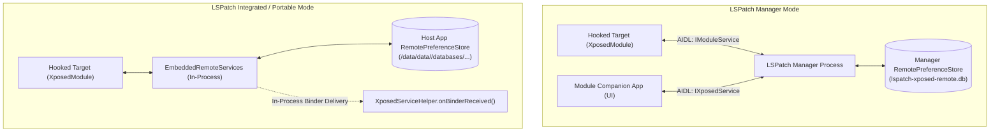

# LibXposed Service & Inter-Process Communication (IPC)

This document provides a technical reference for cross-process communication between the **Module Configuration UI App**, the **LSPosed Framework Daemon**, and **Hooked Target Processes** using `io.github.libxposed:service` (API 101 / 102+).

> [!NOTE]
> **Source Verification**: Sourced directly from [libxposed/service](https://github.com/libxposed/service) source code, the [LSPosed Wiki: New XSharedPreferences](https://github.com/LSPosed/LSPosed/wiki/New-XSharedPreferences), the official [libxposed-example](https://github.com/libxposed/example), and validated against live LSPosed 2.2.0-beta6 running on the connected Android device.

---

## 1. Evolution of Content Sharing & IPC

Android's evolving security model (SELinux, scoped storage, multi-user isolation) progressively broke traditional module configuration sharing methods:

| Mechanism | Legacy Xposed (`de.robv...`) | LSPosed v1.x (API 93+) | Modern LibXposed (API 101/102+) |
| :--- | :--- | :--- | :--- |
| **API Class** | `XSharedPreferences` | `XSharedPreferences` (hooked) | `XposedService` (App) / `XposedInterface` (Target) |
| **Underlying IPC** | Direct file read (`MODE_WORLD_READABLE`) | SELinux-redirected filesystem path | **Binder IPC to LSPosed Daemon Database** |
| **Storage Location** | `/data/data/<module>/shared_prefs/` | `/data/misc/.../prefs/<module>` | **LSPosed Daemon Secure SQLite Store** |
| **SELinux Enforcement** | Broken on Android 7.0+ (Nougat) | Requires root daemon file redirection | Native Binder transactions; zero filesystem exposure |
| **Change Listeners** | ❌ None | ⚠️ File-watch only (`key` is always `null`) | ✅ **Real-time Binder notifications with exact `key`** |
| **Arbitrary Files** | ❌ World-readable files blocked | ❌ World-readable files blocked | ✅ **Remote Files (`ParcelFileDescriptor`)** |
| **Multi-User Isolation** | ❌ None (leaks across profiles) | ⚠️ Partial | ✅ **Strict Per-User Isolation** |
| **Dynamic Scope** | ❌ Manual reboot required | ❌ LSPosed Manager UI only | ✅ **Programmatic `requestScope()` / `removeScope()`** |
| **Target Hot Reload** | ❌ Full app restart / reboot | ❌ Full app restart / reboot | ✅ **Live `hotReloadModule()` (API 102+)** |

---

## 2. Architecture Diagram

```mermaid
flowchart TD
    subgraph ModuleApp ["Module Configuration App (UI / Settings)"]
        Activity["Settings Activity / ViewModel"]
        XPProvider["XposedProvider\n(ContentProvider)"]
        XPService["XposedServiceHelper\n-> XposedService Binder"]
        Activity --> XPService
        XPProvider -.->|Receives Binder via call()| XPService
    end

    subgraph LSPDaemon ["LSPosed Framework Daemon (lspd)"]
        DaemonDB[(Secure SQLite Store)]
        FileStore["/data/adb/lspd/modules/..."]
        ScopeEngine["Scope Policy Manager"]
        ReloadEngine["Hot Reload Coordinator"]
    end

    subgraph HookedProcess ["Hooked Application Process"]
        XPModule["XposedModule\n(Inside Target App)"]
        RemotePrefs["RemotePreferences\n(Implements SharedPreferences)"]
        XPModule --> RemotePrefs
    end

    XPService <-->|AIDL: IXposedService| LSPDaemon
    XPModule <-->|Framework Internal Hook| LSPDaemon
    LSPDaemon -->|Binder: IRemotePreferencesListener| RemotePrefs
```

---

## 3. Remote Preferences

Remote Preferences implement standard `android.content.SharedPreferences`, making integration seamless with existing Android UI components (`PreferenceFragmentCompat`, Jetpack Compose state, etc.).

### 3.1 Reading in Hooked Target Process (`XposedModule`)

In your target-hooked module code, access preferences via `getRemotePreferences(group)`:

```kotlin
class MyModule : XposedModule() {
    override fun onPackageReady(param: PackageReadyParam) {
        if (!param.isFirstPackage) return

        // 1. Obtain group-named SharedPreferences
        val prefs: SharedPreferences = getRemotePreferences("settings")

        // 2. Read values with defaults
        val isFeatureEnabled = prefs.getBoolean("enable_feature", false)
        val customText = prefs.getString("custom_text", "default")
        val counter = prefs.getInt("counter", 0)

        // 3. Register real-time change listener
        // Unlike legacy XSharedPreferences, key is non-null and identifies the exact modified entry
        prefs.registerOnSharedPreferenceChangeListener { sharedPrefs, key ->
            log(Log.INFO, "MyModule", "Preference changed: $key")
            when (key) {
                "enable_feature" -> {
                    val updated = sharedPrefs.getBoolean(key, false)
                    // Apply immediate logic change without restarting target process
                }
            }
        }
    }
}
```

### 3.2 Writing in Module Configuration App (`XposedService`)

In your module's Activity or ViewModel, obtain the `XposedService` instance and write via `edit()`:

```kotlin
val prefs = service.getRemotePreferences("settings")

// Standard SharedPreferences Editor API
prefs.edit()
    .putBoolean("enable_feature", true)
    .putString("custom_text", "Updated value from UI")
    .putInt("counter", 42)
    .apply() // Asynchronously committed to LSPosed daemon store
```

### 3.3 Deleting Remote Preferences
To delete an entire preference group:
```kotlin
service.deleteRemotePreferences("settings")
```

---

## 4. Remote Files (Binary Data & Large Blobs)

For data larger than Binder transaction limits (e.g. JSON rule sets, SQLite databases, scripts, images), modern LibXposed provides **Remote Files**. Files are stored in the module's private directory inside the LSPosed daemon storage and streamed via `ParcelFileDescriptor`.

### 4.1 Writing a Remote File (Module App)

```kotlin
import android.os.ParcelFileDescriptor
import java.io.FileWriter

// Opens or creates the file in the LSPosed daemon store
service.openRemoteFile("rules.json").use { pfd ->
    FileWriter(pfd.fileDescriptor).use { writer ->
        writer.write("{\"filter_ads\": true, \"version\": 2}")
    }
}
```

### 4.2 Reading a Remote File (Hooked Target)

```kotlin
import java.io.FileNotFoundException
import java.io.FileReader

try {
    openRemoteFile("rules.json").use { pfd ->
        val content = FileReader(pfd.fileDescriptor).readText()
        log(Log.INFO, "MyModule", "Loaded remote rules: $content")
    }
} catch (e: FileNotFoundException) {
    log(Log.WARN, "MyModule", "Remote file rules.json not found")
}
```

### 4.3 Listing & Deleting Remote Files

```kotlin
// In Module App:
val files: Array<String> = service.listRemoteFiles()
val deleted: Boolean = service.deleteRemoteFile("old_cache.dat")

// In Hooked Target:
val targetFiles: Array<String> = listRemoteFiles()
```

> [!CAUTION]
> Filenames passed to `openRemoteFile` and `deleteRemoteFile` must not contain path separators (`/`) or relative navigation (`.` or `..`). Violations throw `IllegalArgumentException`.

---

## 5. Module App Integration Guide

### 5.1 Gradle Dependencies (`build.gradle.kts`)

```kotlin
dependencies {
    // Compile-only LibXposed API for module hooking
    compileOnly("io.github.libxposed:api:102.0.0")

    // Implementation of service client for UI / settings app
    implementation("io.github.libxposed:service:102.0.0")
}
```

### 5.2 Manifest Provider Setup (`AndroidManifest.xml`)

The `libxposed:service` library includes an internal `XposedProvider` ContentProvider that receives the service binder directly from the LSPosed framework. 

When you add `implementation("io.github.libxposed:service:...")`, Gradle's Manifest Merger automatically merges the provider:
```xml
<provider
    android:name="io.github.libxposed.service.XposedProvider"
    android:authorities="${applicationId}.XposedService"
    android:exported="true"
    tools:ignore="ExportedContentProvider" />
```

> [!IMPORTANT]
> The provider authority must follow `${applicationId}.XposedService` (case-sensitive). If declaring manually, do NOT customize the authority suffix.

### 5.3 Application Class Setup (`App.kt`)

Use `XposedServiceHelper.registerListener` in `Application.onCreate()` to safely listen for binder connections:

```kotlin
package com.example.module

import android.app.Application
import io.github.libxposed.service.XposedService
import io.github.libxposed.service.XposedServiceHelper
import java.util.concurrent.CopyOnWriteArraySet
import kotlin.concurrent.Volatile

class App : Application(), XposedServiceHelper.OnServiceListener {

    companion object {
        @Volatile
        var service: XposedService? = null
            private set

        private val listeners = CopyOnWriteArraySet<ServiceConnectionListener>()

        fun addConnectionListener(listener: ServiceConnectionListener, notifyImmediately: Boolean = true) {
            listeners.add(listener)
            if (notifyImmediately) {
                listener.onServiceConnected(service)
            }
        }

        fun removeConnectionListener(listener: ServiceConnectionListener) {
            listeners.remove(listener)
        }
    }

    override fun onCreate() {
        super.onCreate()
        // Register listener for LSPosed Framework Service binder
        XposedServiceHelper.registerListener(this)
    }

    interface ServiceConnectionListener {
        fun onServiceConnected(service: XposedService?)
    }

    override fun onServiceBind(service: XposedService) {
        App.service = service
        listeners.forEach { it.onServiceConnected(service) }
    }

    override fun onServiceDied(service: XposedService) {
        if (App.service == service) {
            App.service = null
            listeners.forEach { it.onServiceConnected(null) }
        }
    }
}
```

---

## 6. Service Diagnostics & Properties

Once connected, `XposedService` exposes system capability and version information:

```kotlin
val apiVersion: Int = service.apiVersion              // e.g. 102
val frameworkName: String = service.frameworkName       // e.g. "LSPosed"
val frameworkVersion: String = service.frameworkVersion // e.g. "2.2.0-beta6"
val frameworkVersionCode: Long = service.frameworkVersionCode // e.g. 7480

// Inspect framework capability bitmask
val props = service.frameworkProperties

val hasSystemCap = (props and XposedService.PROP_CAP_SYSTEM) != 0L
val hasRemoteCap = (props and XposedService.PROP_CAP_REMOTE) != 0L
val hasApiProtection = (props and XposedService.PROP_RT_API_PROTECTION) != 0L
```

---

## 7. Dynamic Scope Management

LibXposed allows modules to programmatically inspect, request, and revoke scope targets without requiring the user to navigate into the LSPosed Manager UI:

```kotlin
// 1. Query current approved scope
val currentScope: List<String> = service.scope

// 2. Request user approval to add packages to scope
val targetPackages = listOf("com.target.app", "com.target.companion")

service.requestScope(targetPackages, object : XposedService.OnScopeEventListener {
    override fun onScopeRequestApproved(approved: List<String>) {
        // Framework displayed a prompt to user and user granted permission
        runOnUiThread {
            Toast.makeText(context, "Scope granted for: $approved", Toast.LENGTH_SHORT).show()
        }
    }

    override fun onScopeRequestFailed(message: String) {
        // User denied or request timed out
        runOnUiThread {
            Toast.makeText(context, "Scope request failed: $message", Toast.LENGTH_SHORT).show()
        }
    }
})

// 3. Remove packages from module scope
service.removeScope(listOf("com.target.companion"))
```

---

## 8. Querying Running Targets & Triggering Hot Reload (API 102+)

In API 102+, modules can inspect currently running hooked processes and trigger on-demand live hot reload:

```kotlin
if (service.apiVersion >= XposedService.API_102) {
    val targets: List<HookedTarget> = service.runningTargets

    for (target in targets) {
        Log.i("ModuleApp", "Hooked Target: pid=${target.pid}, pkg=${target.processName}, state=${target.state}, version=${target.loadedVersionCode}")

        // Target states: UP_TO_DATE, STALE, RELOADING, FAILED
        if (target.state == HookedTarget.State.STALE) {
            val extraData = Bundle().apply {
                putString("reason", "module_apk_updated")
            }

            service.hotReloadModule(target, extraData) { targetProcess, result ->
                when (result.status) {
                    HotReloadResult.Status.SUCCEEDED -> {
                        Log.i("ModuleApp", "Hot reload succeeded for ${targetProcess.processName}")
                    }
                    HotReloadResult.Status.FAILED -> {
                        Log.e("ModuleApp", "Hot reload failed: ${result.message}")
                    }
                    HotReloadResult.Status.UNSUPPORTED -> {
                        Log.w("ModuleApp", "Hot reload unsupported on target")
                    }
                    HotReloadResult.Status.IN_PROGRESS -> {
                        Log.i("ModuleApp", "Target is already reloading")
                    }
                    HotReloadResult.Status.PROCESS_DIED -> {
                        Log.w("ModuleApp", "Target process terminated during reload")
                    }
                }
            }
        }
    }
}
```

---

## 9. Rootless Environment (LSPatch) IPC Architecture

When running under **LSPatch** without root, the LibXposed Service IPC subsystem adapts its underlying transport while maintaining complete API compatibility for `XposedService`, `RemotePreferences`, and `RemoteFiles`.

### 9.1 Mode-Dependent IPC Routing



### 9.2 IPC Transport Differences

| Feature | Rootful LSPosed (`lspd`) | LSPatch Manager Mode | LSPatch Integrated Mode |
| :--- | :--- | :--- | :--- |
| **Backing Process** | Global root daemon (`/data/adb/lspd`) | LSPatch Manager app process | **Self-contained in target host process** |
| **Database File** | `/data/adb/lspd/config/modules_config.db` | Manager's `lspatch-xposed-remote.db` | Target app's `lspatch-xposed-remote.db` |
| **Binder Delivery** | System-pushed to `XposedProvider` | Manager-pushed to `XposedProvider` | **Direct in-process method call** |
| **`requestScope()`** | System dialog prompt to user | ❌ Always fails (`onScopeRequestFailed`) | ❌ Always fails (`onScopeRequestFailed`) |
| **`hotReloadModule()`** | Fully supported across targets | Supported via `ManagerHotReloadDriver` | ❌ Throws `HOT_RELOAD_UNSUPPORTED` |
| **Framework Name** | `"LSPosed"` | `"LSPatch"` | `"LSPatch"` |
| **Framework Properties**| `PROP_CAP_SYSTEM \| PROP_CAP_REMOTE` | `PROP_CAP_REMOTE` | `PROP_CAP_REMOTE` |

### 9.3 Handling Scope and Capability Differences in Code

```kotlin
// Check framework capabilities dynamically
val props = service.frameworkProperties
val isRootful = (props and XposedService.PROP_CAP_SYSTEM) != 0L

if (!isRootful) {
    // In LSPatch rootless mode:
    // 1. requestScope() cannot grant new apps dynamically; notify the user to re-patch
    // 2. hotReloadModule() is only available if Manager Mode is active
    Log.i("ModuleApp", "Running in rootless LSPatch mode")
}
```

For complete architectural details on LSPatch, see [LSPatch Rootless Patching Guide](./lspatch_rootless_patching.md).

