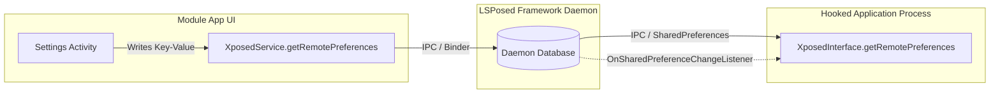

# LibXposed Service & Inter-Process Communication (IPC)

This document provides a comprehensive guide for cross-process communication between the **Module App (UI/Settings)**, the **LSPosed Framework Daemon**, and **Hooked Target Processes**.

---

## 1. Content Sharing Architecture & Evolution

In legacy Xposed, modules shared settings with hooked applications using `XSharedPreferences`, which relied on the Android filesystem permission `MODE_WORLD_READABLE`. Starting with Android Nougat (7.0+) and enforced in Oreo (8.0+), world-readable files were strictly banned by SELinux and Android security policies.

### Comparison of Content Sharing Mechanisms
| Feature | Legacy XSharedPreferences | New XSharedPreferences (LSPosed v1.x) | Modern Remote Preferences (LibXposed) | Modern Remote Files (LibXposed) |
| :--- | :--- | :--- | :--- | :--- |
| **API Framework** | Legacy `de.robv...` | LSPosed API 93+ | LibXposed API 101/102+ | LibXposed API 101/102+ |
| **Storage Location** | `/data/data/<module>/shared_prefs/` | `/data/misc/<random>/prefs/<module>` | **LSPosed Daemon Database** | `/data/adb/lspd/modules/<user>/<module>` |
| **Access in Module** | Read / Write (`Context`) | Read / Write (`MODE_WORLD_READABLE`) | **Read / Write** (`XposedService`) | **Read / Write** (`XposedService`) |
| **Access in Target** | Read-Only | Read-Only | **Read-Only** (`XposedInterface`) | **Read-Only** (`XposedInterface`) |
| **Change Listeners**| ❌ No | ⚠️ Yes (physical file watch, key is null) | ✅ **Yes (Key-specific notifications)** | ❌ No |
| **Payload Size** | Small/Medium XML | Small/Medium XML | Key-Value Pairs (< 1 MB) | **Large Blobs & Arbitrary Files** |
| **Multi-User Safe** | ❌ No | ⚠️ Partial | ✅ **Fully Multi-User Isolated** | ✅ **Fully Multi-User Isolated** |

---

## 2. Remote Preferences

Remote Preferences provide an atomic, multi-process key-value configuration store managed directly by the LSPosed daemon.



### 2.1 Reading Remote Preferences in Hooked Targets
In your `XposedModule` class running inside the target app:

```java
public class MyModule extends XposedModule {
    @Override
    public void onPackageReady(@NonNull PackageReadyParam param) {
        // Retrieve read-only RemotePreferences for group "settings"
        SharedPreferences prefs = getRemotePreferences("settings");

        boolean isFeatureEnabled = prefs.getBoolean("enable_feature", false);
        String customTitle = prefs.getString("custom_title", "Default Title");

        // Register real-time change listener
        prefs.registerOnSharedPreferenceChangeListener((sharedPreferences, key) -> {
            log(Log.INFO, "MyModule", "Preference changed: " + key);
            if ("enable_feature".equals(key)) {
                boolean updatedVal = sharedPreferences.getBoolean(key, false);
                // React to configuration update immediately!
            }
        });
    }
}
```

### 2.2 Writing Remote Preferences in Module UI App
In your Module's configuration app (Activity, Fragment, or ViewModel):

```kotlin
// Retrieve XposedService instance via XposedServiceHelper
val prefs = xposedService.getRemotePreferences("settings")

// Write preferences using standard SharedPreferences.Editor
prefs.edit()
    .putBoolean("enable_feature", true)
    .putString("custom_title", "Supercharged Title")
    .putInt("retry_count", 5)
    .apply() // Asynchronously committed to LSPosed daemon
```

---

## 3. Remote Files (Binary Blobs & Large Data)

When modules need to share arbitrary files (e.g. SQLite databases, media files, dynamic scripts, configuration JSONs) that exceed Binder transaction limits, use **Remote Files**.

### 3.1 Writing Remote Files in Module App
```kotlin
// Open or create a remote file in the shared module directory
val pfd: ParcelFileDescriptor = xposedService.openRemoteFile("rules.json")

ParcelFileDescriptor.AutoCloseOutputStream(pfd).use { stream ->
    stream.write(jsonString.toByteArray(Charsets.UTF_8))
}
```

### 3.2 Reading Remote Files in Hooked Targets
```java
try (ParcelFileDescriptor pfd = openRemoteFile("rules.json")) {
    try (FileReader reader = new FileReader(pfd.getFileDescriptor())) {
        String content = new BufferedReader(reader).lines().collect(Collectors.joining("\n"));
        log(Log.INFO, TAG, "Loaded remote rules:\n" + content);
    }
} catch (FileNotFoundException e) {
    log(Log.WARN, TAG, "Remote file rules.json does not exist yet");
}
```

### 3.3 Listing and Deleting Remote Files
```kotlin
// In Module App:
val files: Array<String> = xposedService.listRemoteFiles()
xposedService.deleteRemoteFile("old_cache.dat")

// In Hooked Target (read-only listing):
String[] fileList = listRemoteFiles();
```

---

## 4. Module App Setup with `XposedServiceHelper`

To allow your module app to communicate with the LSPosed framework daemon:

### 4.1 Dependency Setup (`build.gradle.kts`)
```kotlin
dependencies {
    compileOnly("io.github.libxposed:api:102.0.0")
    implementation("io.github.libxposed:service:102.0.0")
}
```

### 4.2 Manifest Configuration (`AndroidManifest.xml`)
The `XposedProvider` ContentProvider must be declared in your module's `AndroidManifest.xml` so the LSPosed daemon can deliver the service binder on launch:

```xml
<manifest xmlns:android="http://schemas.android.com/apk/res/android">
    <application ...>
        <!-- ContentProvider that receives the LSPosed Service Binder -->
        <provider
            android:name="io.github.libxposed.service.XposedProvider"
            android:authorities="${applicationId}.xposed_provider"
            android:exported="true"
            android:permission="android.permission.INTERACT_ACROSS_USERS_FULL" />
    </application>
</manifest>
```

> [!NOTE]
> If targeting Android 11+ (API 30+), `XposedProvider` automatically notifies `RemotePreferences` when preferences are cleared or updated.

### 4.3 Registering the Service Listener in Application / Activity
```kotlin
class App : Application() {
    companion object {
        var xposedService: XposedService? = null
            private set
    }

    override fun onCreate() {
        super.onCreate()
        
        // Register listener for LSPosed Framework Service
        XposedServiceHelper.registerListener(object : XposedServiceHelper.OnServiceListener {
            override fun onServiceBind(service: XposedService) {
                Log.i("ModuleApp", "Connected to Xposed Framework: ${service.frameworkName} ${service.frameworkVersion} (API ${service.apiVersion})")
                xposedService = service
            }

            override fun onServiceDied(service: XposedService) {
                Log.w("ModuleApp", "Xposed Framework service disconnected")
                if (xposedService == service) {
                    xposedService = null
                }
            }
        })
    }
}
```

---

## 5. Dynamic Scope Management

LibXposed allows modules to dynamically query, request, and remove scoped target packages from within the module app:

```kotlin
// 1. Get current active scope list
val activeScope: List<String> = service.scope

// 2. Request user approval to add new packages to scope
val requestedPackages = listOf("com.instagram.android", "com.twitter.android")
service.requestScope(requestedPackages, object : XposedService.OnScopeEventListener {
    override fun onScopeRequestApproved(approved: List<String>) {
        Log.i("ModuleApp", "User approved scope: $approved")
    }

    override fun onScopeRequestFailed(message: String) {
        Log.e("ModuleApp", "Scope request rejected: $message")
    }
})

// 3. Remove packages from scope
service.removeScope(listOf("com.unwanted.app"))
```

---

## 6. Querying Hooked Targets & Triggering Hot Reload (API 102+)

The module UI app can query running hooked processes and trigger on-demand hot reloading:

```kotlin
// 1. Query all running processes currently hooked by this module
val targets: List<HookedTarget> = service.runningTargets

for (target in targets) {
    Log.i("ModuleApp", "Hooked Target: pid=${target.pid}, pkg=${target.processName}, state=${target.state}")
    
    // Check if target is running an older generation
    if (target.state == HookedTarget.State.STALE) {
        // Trigger Hot Reload for this specific process
        val extraData = Bundle().apply {
            putString("reload_reason", "settings_updated")
        }
        
        service.hotReloadModule(target, extraData) { target, result ->
            when (result.status) {
                HotReloadResult.Status.SUCCESS -> 
                    Log.i("ModuleApp", "Hot reload succeeded for ${target.processName}")
                HotReloadResult.Status.FAILED -> 
                    Log.e("ModuleApp", "Hot reload failed: ${result.message}")
                HotReloadResult.Status.UNSUPPORTED -> 
                    Log.w("ModuleApp", "Hot reload unsupported on target")
            }
        }
    }
}
```
